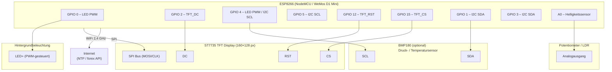
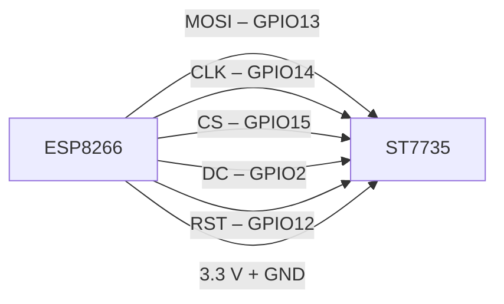
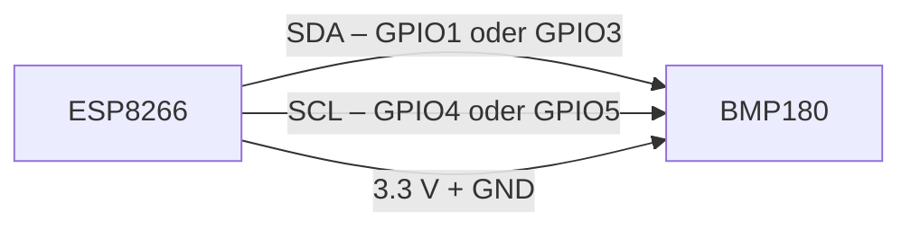
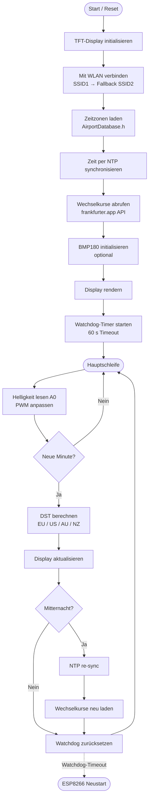
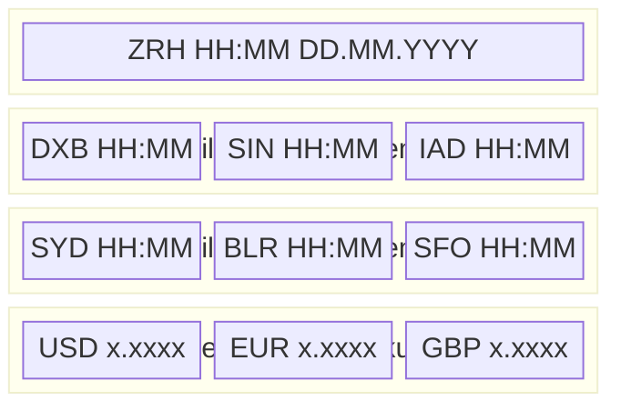

# Desk_Top_Widget_II_opt – Schaltungsschema

## 1. Schaltplan (Hardwareverbindungen)

---

## 2. SPI-Bus-Detail (TFT-Anschluss)

---

## 3. I²C-Bus-Detail (BMP180-Anschluss)

---

## 4. Systemarchitektur (Software-Ablauf)

---

## 5. Display-Layout (Bildschirmaufteilung)

---

## 6. Pin-Übersicht (Tabelle)

| GPIO | Funktion            | Angeschlossenes Bauteil |
|------|---------------------|-------------------------|
| 0    | PWM – LED-Helligkeit | Hintergrundbeleuchtung  |
| 2    | TFT_DC (Data/Cmd)   | ST7735                  |
| 12   | TFT_RST (Reset)     | ST7735                  |
| 13   | SPI MOSI            | ST7735                  |
| 14   | SPI CLK             | ST7735                  |
| 15   | TFT_CS (Chip Select)| ST7735                  |
| 1/3  | I²C SDA             | BMP180 (optional)       |
| 4/5  | I²C SCL             | BMP180 (optional)       |
| A0   | Analogeingang       | Potentiometer / LDR     |
