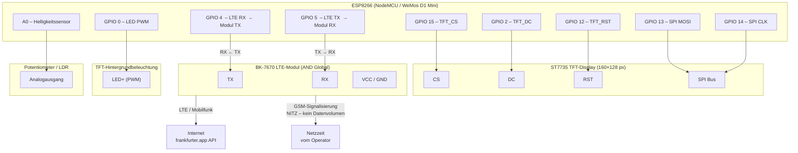
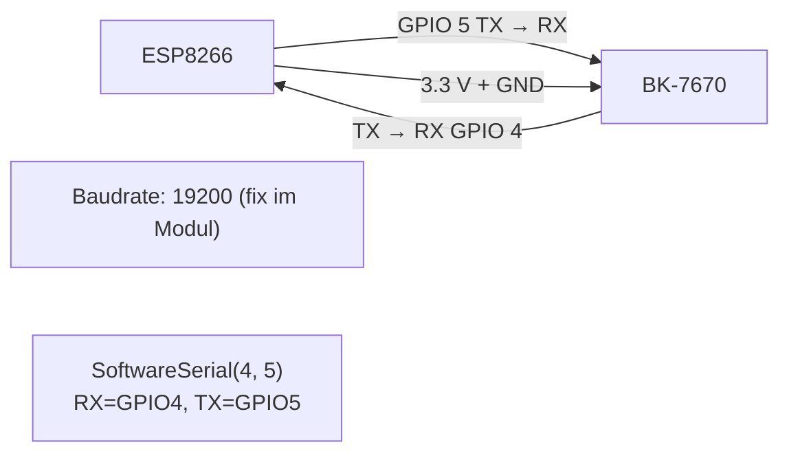
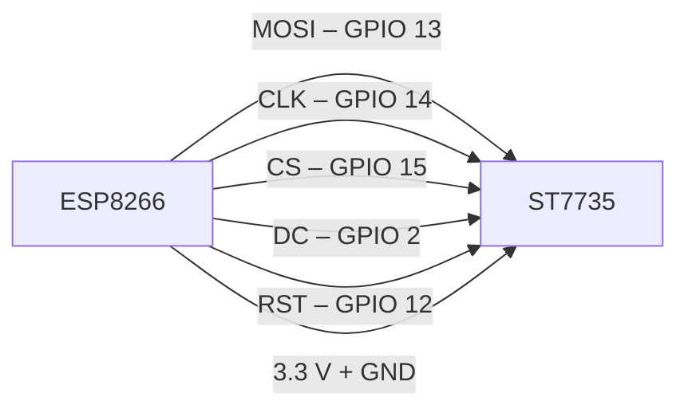
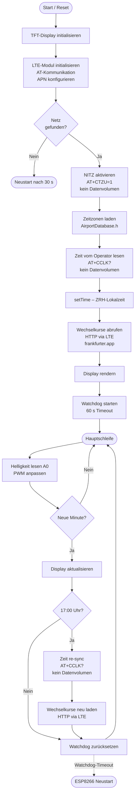
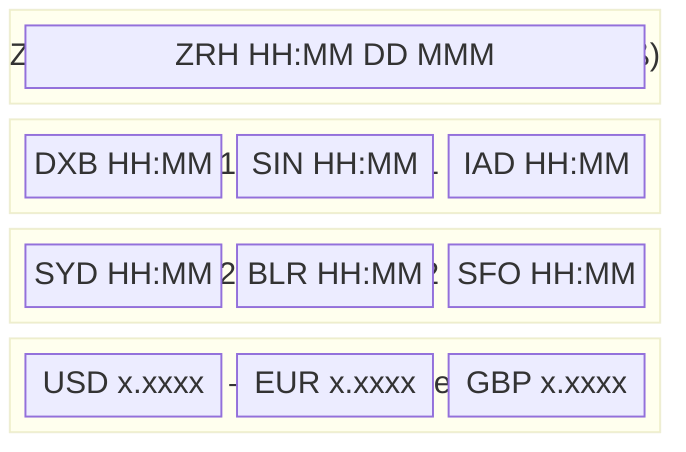

# ForEx_2_1 – Schaltungsschema

Hardware-Version: **ForEx_1_1** mit BK-7670 LTE-Modul (AND Global) anstelle des BMP180.
GPIO 4 und GPIO 5 sind nun für die UART-Verbindung zum LTE-Modul belegt.

---

## 1. Übersichtsplan (alle Baugruppen)



---

## 2. UART-Detail – ESP8266 ↔ BK-7670



> **Achtung – Spannungsebenen:**
> Der ESP8266 arbeitet mit 3.3 V. Prüfen Sie, ob der BK-7670 ebenfalls
> 3.3 V-Logik auf den UART-Pins verwendet. Falls das Modul 1.8 V-Logik
> hat, ist ein Level-Shifter erforderlich.

---

## 3. SPI-Detail – ESP8266 ↔ ST7735 TFT



---

## 4. Software-Ablauf (Flussdiagramm)



---

## 5. Display-Layout (Bildschirmaufteilung)



---

## 6. Pin-Übersicht (Tabelle)

| GPIO | Richtung | Funktion                     | Bauteil                       |
|------|----------|------------------------------|-------------------------------|
| 0    | Ausgang  | PWM – Display-Helligkeit     | TFT-Hintergrundbeleuchtung    |
| 2    | Ausgang  | TFT Data/Command             | ST7735                        |
| 4    | **Eingang** | UART RX (← Modul TX)     | BK-7670 TX                    |
| 5    | **Ausgang** | UART TX (→ Modul RX)     | BK-7670 RX                    |
| 12   | Ausgang  | TFT Reset                    | ST7735                        |
| 13   | Ausgang  | SPI MOSI                     | ST7735                        |
| 14   | Ausgang  | SPI CLK                      | ST7735                        |
| 15   | Ausgang  | TFT Chip-Select              | ST7735                        |
| A0   | Eingang  | Analogeingang Helligkeit     | Potentiometer / LDR           |

---

## 7. Provider-Konfiguration

Die APN-Einstellung wird als Konstante in `ForEx_2_1.ino` gewählt:

```cpp
#define ACTIVE_PROVIDER  0   // 0 = M-Budget Mobile, 1 = Digital Republic
```

| `ACTIVE_PROVIDER` | Provider          | Netz      | APN                  |
|:-----------------:|-------------------|-----------|----------------------|
| `0`               | M-Budget Mobile   | Swisscom  | `gprs.swisscom.ch`   |
| `1`               | Digital Republic  | Salt      | `internet`           |

> Falls die Verbindung mit dem voreingestellten APN nicht klappt, bitte
> beim Provider nachfragen oder die Konstante `LTE_APN` direkt in
> `ForEx_2_1.ino` anpassen.

---

## 8. Zeitabfrage – Datenvolumen

| Funktion                           | Methode                  | Datenvolumen |
|------------------------------------|--------------------------|:------------:|
| Zeit synchronisieren               | AT+CCLK? (NITZ/GSM)     | **0 Byte**   |
| Wechselkurse abrufen               | HTTP GET frankfurter.app | ~300 Byte    |
| **Gesamt pro Tag**                 |                          | **~300 Byte** |

Die Zeitabfrage über NITZ ist Teil der GSM-Signalisierung und verursacht
**keinen Datenverbrauch** – ideal für PrePaid-SIM mit begrenztem Volumen.
